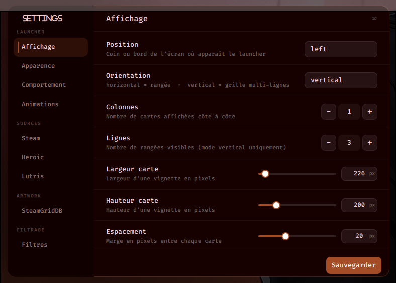

<div align="center">

# Quickshell Game Launcher

**Sleek game launcher for Hyprland with pywal/wallust & matugen theming**

[](https://github.com/Eaquo/quickshell-games-launchers/stargazers)
[](https://hyprland.org)
[](https://aur.archlinux.org/packages/quickshell-games-launchers-git)

[](https://codeberg.org/explosion-mental/wallust)
[](https://github.com/InioX/matugen)

<br>

<table>
<tr>
<td width="50%" align="center">

**📸 Preview**


</td>
<td width="50%" align="center">

**🎬 Demo**

https://github.com/user-attachments/assets/703e48dd-86d1-49cb-8bc8-1fe45b89e9f5

</td>
</tr>
</table>

[**Features**](#-features) · [**Install**](#%EF%B8%8F-installation) · [**Configuration**](#%EF%B8%8F-configuration) · [**Theming**](#-theming) · [**Big Picture**](#-big-picture-mode) · [**Gamepad**](#-gamepad)

<sub>🎨 Theming — [Wallust / pywal](#wallust--pywal) · [Matugen Material You](#matugen-material-you)</sub>

</div>

---

## ✨ Features

- 🎯 Steam, Heroic (Epic / GOG / Amazon / Sideload), Lutris, and manual entries
- 🎮 Non-Steam shortcuts detection via `shortcuts.vdf`
- 🖼️ Animated cover art from Steam CDN / SteamGridDB (WebP heroes)
- 🚀 Animated launch overlay — cover expands fullscreen with logo + start indicator
- 📺 **Big Picture mode** — fullscreen Steam Deck-style view with hero, stats, and game strip
- 🕹️ Gamepad support — navigate, launch, favorites, Big Picture via X button
- ⚙️ **In-app config panel** — live settings editor with 9 sections, no restart needed
- 🎨 **Wallust / pywal** theming — auto accent colors from your wallpaper
- 🎨 **Matugen** theming — Material You palette, mutually exclusive with wallust
- 🌍 **i18n** — auto-detected language: 🇫🇷 🇬🇧 🇪🇸 🇷🇺 🇯🇵
- ⭐ Favorites, 🆕 NEW/RECENT badges, 🔍 live search
- ⌨️ Keyboard, scroll wheel, and gamepad navigation

## ⌨️ Controls

| Key | Action |
|-----|--------|
| `SUPER + G` | Open / Close the launcher |
| `↑ ↓ ← →` | Navigate the grid |
| `Enter` | Launch selected game |
| `Double-click` | Launch a game |
| `Esc` | Close |
| `Scroll wheel` | Scroll through games |
| `ALT + F` | Toggle favorite |
| `ALT + B` | Toggle Big Picture mode |
| `F5` | Refresh game list |

---

## 📺 Big Picture Mode


Full-screen Steam Deck-style interface:
- **Hero image** — wide banner (from Steam CDN or SteamGridDB)
- **Stats panel** — playtime, last session, install size, last update
- **Game strip** — scrollable list at the bottom
- **Launch overlay** — logo + "Start Game◦◦◦" animation

## ⚙️ Config Panel



Live settings editor — 9 sections, changes apply without restarting Quickshell.

## 🎮 Gamepad

| Button | Action |
|--------|--------|
| D-pad | Navigate the grid |
| A | Launch selected game |
| X | Toggle Big Picture mode |
| SELECT | Toggle favorite |
| B | Close |

---

## 📋 Prerequisites

```bash
# Arch Linux — core
sudo pacman -S python qt6-declarative

# Python dependencies
pip install vdf tomlkit

# Quickshell (AUR)
yay -S quickshell-git

# Font Awesome 7 (icons)
yay -S ttf-font-awesome-7
```

---

## 🛠️ Installation

### Via AUR
```bash
paru -S quickshell-games-launchers-git
# or
yay -S quickshell-games-launchers-git
```
```bash
quickshell-game
```

### From source
```bash
git clone https://github.com/Eaquo/quickshell-games-launchers.git
cp -r quickshell-games-launchers/game-launcher ~/.config/quickshell/game-launcher
```

### Hyprland keybind

Add to `~/.config/hypr/hyprland.conf`:

**AUR install:**
```conf
bind = SUPER, G, exec, quickshell-game
```

**From source:**
```conf
bind = SUPER, G, exec, ~/.config/quickshell/game-launcher/toggle.sh
```

---

## ⚙️ Configuration

All settings live in `~/.config/quickshell/game-launcher/config.toml`.  
Most can also be changed live from the **in-app config panel** (gear button, bottom-right of the sidebar).

<details>
<summary><b>Display</b></summary>

```toml
[display]
position    = "bottom"       # center | top | bottom | left | right
orientation = "horizontal"   # horizontal | vertical
grid_size   = [3, 1]         # [columns, rows]
item_width  = 400
item_height = 200
spacing     = 20
```
</details>

<details>
<summary><b>Appearance</b></summary>

```toml
[appearance]
# Wallust / pywal — mutually exclusive with use_matugen
use_wallust  = true
wallust_path = "~/.cache/wal/wal.json"

# Matugen (Material You) — mutually exclusive with use_wallust
use_matugen         = false
matugen_colors_path = "~/.cache/matugen/game_launcher_colors.json"

blur_background    = true
background_opacity = 0.85
```
</details>

<details>
<summary><b>Behavior</b></summary>

```toml
[behavior]
sort_by              = "recent"   # recent | name | playtime
show_favorites_first = true
close_on_launch      = true

# Tab shown on startup: 0 = All, 1 = Steam, 2 = Heroic, etc.
default_source_index = 0
# Remember the last active tab between sessions
remember_source      = false

# Open directly in Big Picture mode on startup
start_in_bigpicture  = false
```
</details>

<details>
<summary><b>Animations</b></summary>

```toml
[animations]
duration_ms = 300   # open/close animation duration in milliseconds
```
</details>

<details>
<summary><b>Steam</b></summary>

```toml
[steam]
enabled = true
library_paths = [
    "~/.local/share/Steam/steamapps",
    "~/.var/app/com.valvesoftware.Steam/data/Steam/steamapps",  # Flatpak
    # "/mnt/games/SteamLibrary/steamapps",                      # external drive
]
```
</details>

<details>
<summary><b>Heroic</b> (Epic / GOG / Amazon)</summary>

```toml
[heroic]
enabled = true
config_paths = [
    "~/.config/heroic",
    "~/.var/app/com.heroicgameslauncher.hgl/config/heroic",  # Flatpak
]
scan_epic     = true
scan_gog      = true
scan_amazon   = true
scan_sideload = true
```
</details>

<details>
<summary><b>Lutris</b></summary>

```toml
[lutris]
enabled = true
db_path = "~/.local/share/lutris/pga.db"
```
</details>

<details>
<summary><b>SteamGridDB</b> (optional — animated covers)</summary>

Get a free API key at [steamgriddb.com/profile/preferences/api](https://www.steamgriddb.com/profile/preferences/api).

```toml
[steamgriddb]
enabled  = true
api_key  = "your_key_here"

# "hero" → wide banner  |  "grid" → portrait cover  |  "logo"  |  "icon"
image_type      = "hero"
prefer_animated = true
fallback_to_steam = true

sort_by_likes = true
min_likes     = 0

# Content filters
nsfw      = false
humor     = false
epilepsy  = false

# Performance
parallel_requests = true
max_workers       = 12
request_timeout   = 3    # seconds
cache_ttl_hours   = 48
```
</details>

<details>
<summary><b>Filtering</b></summary>

```toml
[filtering]
games_only         = false
exclude_categories = ["desktop"]
exclude_keywords   = ["Launcher", "Manager", "Runtime", "SDK", "Tool"]
```
</details>

<details>
<summary><b>Manual games</b></summary>

Drop cover images in the `box-art/` folder, then reference them by filename:

```toml
[manual]
box_art_dir = "~/.config/quickshell/game-launcher/box-art"

[[manual.entries]]
title          = "My Game"
launch_command = "my-launch-command"
path_box_art   = "cover.png"
```
</details>

---

## 🎨 Theming

The launcher supports two color backends — **only one can be active at a time**.  
Switch between them in the config panel (Appearance section) or directly in `config.toml`.

### Wallust / pywal

```toml
[appearance]
use_wallust  = true
wallust_path = "~/.cache/wal/wal.json"
```

Wallust runs automatically when your wallpaper changes. No extra setup needed.

### Matugen (Material You)

Matugen generates a Material You palette from your wallpaper.

#### 1 — Install matugen

```bash
yay -S matugen-bin
# or
paru -S matugen-bin
```

#### 2 — Add the launcher template

Create `~/.config/matugen/templates/game_launcher.json`:

```json
{
  "special": {
    "background": "{{colors.background.default.hex}}",
    "foreground": "{{colors.on_background.default.hex}}",
    "cursor":     "{{colors.primary.default.hex}}"
  },
  "colors": {
    "color0":  "{{colors.surface_container_lowest.default.hex}}",
    "color1":  "{{colors.error.default.hex}}",
    "color2":  "{{colors.secondary.default.hex}}",
    "color3":  "{{colors.tertiary.default.hex}}",
    "color4":  "{{colors.primary_container.default.hex}}",
    "color5":  "{{colors.primary.default.hex}}",
    "color6":  "{{colors.secondary_container.default.hex}}",
    "color7":  "{{colors.on_surface.default.hex}}",
    "color8":  "{{colors.surface_variant.default.hex}}",
    "color9":  "{{colors.on_error_container.default.hex}}",
    "color10": "{{colors.on_secondary_container.default.hex}}",
    "color11": "{{colors.on_tertiary_container.default.hex}}",
    "color12": "{{colors.on_primary_container.default.hex}}",
    "color13": "{{colors.inverse_primary.default.hex}}",
    "color14": "{{colors.on_secondary.default.hex}}",
    "color15": "{{colors.on_background.default.hex}}"
  }
}
```

#### 3 — Register the template in `~/.config/matugen/config.toml`

```toml
[config]
reload_apps = false

[templates.game_launcher]
input_path  = "~/.config/matugen/templates/game_launcher.json"
output_path = "~/.cache/matugen/game_launcher_colors.json"
```

#### 4 — Enable in `config.toml`

```toml
[appearance]
use_wallust  = false
use_matugen  = true
matugen_colors_path = "~/.cache/matugen/game_launcher_colors.json"
```

#### 5 — Generate colors

```bash
# From a wallpaper image (picks most dominant color automatically)
matugen image /path/to/wallpaper.jpg --source-color-index 0

# From a hex color directly
matugen color hex "#7c3aed"
```

---

## 🚀 Usage

```bash
# Launch via Quickshell
quickshell -c ~/.config/quickshell/game-launcher/shell.qml

# Or via the toggle script
~/.config/quickshell/game-launcher/toggle.sh

# Test the backend (outputs a JSON list of your games)
python3 ~/.config/quickshell/game-launcher/modules/service/backend.py

# View the full library with paths
python3 ~/.config/quickshell/game-launcher/modules/service/list_games.py
```

---

## 📁 Project Structure

```
game-launcher/
├── shell.qml                      # Quickshell entry point
├── config.toml                    # Main configuration
├── toggle.sh                      # Toggle show/hide
├── modules/
│   ├── GameLauncher.qml           # Main grid + sidebar + keyboard handling
│   ├── GameCard.qml               # Individual game card
│   ├── BigPictureView.qml         # Big Picture fullscreen mode
│   ├── LaunchOverlay.qml          # Fullscreen launch animation
│   ├── ConfigPanel.qml            # In-app config editor (9 sections)
│   ├── I18n.qml                   # Translations: fr / en / es / ru / ja
│   └── service/
│       ├── backend.py             # Game scanning, colors, SteamGridDB
│       ├── config_writer.py       # Writes config.toml preserving comments
│       ├── gamepad.py             # Gamepad / controller support
│       ├── list_games.py          # Library display utility
│       └── fonction/
│           ├── scanners.py        # Steam / Heroic / Lutris scanners
│           ├── sgdb.py            # SteamGridDB client
│           └── image_cache.py     # Cover art cache manager
├── box-art/                       # Manual game covers
└── cache/                         # SteamGridDB image cache
```

---

## 🎯 Technical Notes

- **QML / Qt6** — declarative UI with Quickshell layer-shell integration
- **Python 3.11+** — backend with `tomllib` (stdlib) + `tomlkit` for comment-preserving writes
- **ACF parsing** — Steam library path extraction from `libraryfolders.vdf`
- **VDF binary parsing** — non-Steam game detection via `shortcuts.vdf`
- **Parallel cover fetching** — SteamGridDB images downloaded concurrently
- **Binding-safe controls** — `signal changed(T v)` pattern prevents QML binding breaks

---

## 🔧 Troubleshooting

<details>
<summary><b>Launcher doesn't open</b></summary>

```bash
quickshell -c ~/.config/quickshell/game-launcher/shell.qml
# Read the error output in the terminal
```
</details>

<details>
<summary><b>No Steam games detected</b></summary>

```bash
ls ~/.local/share/Steam/steamapps/*.acf
# Make sure the path in config.toml [steam] library_paths matches
```
</details>

<details>
<summary><b>SteamGridDB covers not loading</b></summary>

- Verify your API key in `config.toml`
- Check `cache/image_cache.json` to see resolved URLs
- Increase `request_timeout` for slow connections
</details>

<details>
<summary><b>Matugen colors not applying</b></summary>

```bash
# Check that the output file was generated
cat ~/.cache/matugen/game_launcher_colors.json

# Re-run matugen manually
matugen image /path/to/wallpaper.jpg --source-color-index 0

# Make sure use_matugen = true and use_wallust = false in config.toml
```
</details>

<details>
<summary><b>Missing Python module</b></summary>

```bash
pip install vdf tomlkit
```
</details>

---

## 🤝 Contributing

Contributions welcome — bug reports, feature suggestions, and edge-case fixes (unusual Steam setups, Heroic Flatpak paths, etc.) are especially appreciated.

---

## 📝 License

MIT License — free to use and modify.

---

## 🙏 Credits

Inspired by [caelestia-dots/shell](https://github.com/caelestia-dots/shell)

- **[Quickshell](https://github.com/outfoxxed/quickshell)** — Qt6/QML Wayland shell framework
- **[SteamGridDB](https://www.steamgriddb.com)** — Game cover art API
- **[Wallust](https://codeberg.org/explosion-mental/wallust)** — Color palette from wallpaper
- **[Matugen](https://github.com/InioX/matugen)** — Material You color generation
- **Font Awesome** — Icons
- **Steam / Heroic / Lutris** — Gaming platforms

---

<div align="center">

[](https://ko-fi.com/waxdred)
&nbsp;&nbsp;
[](https://www.reddit.com/user/Embarrassed-Ad2725/)

**Author** · Florian &nbsp;·&nbsp; **Version** · 2.0.0 &nbsp;·&nbsp; **Date** · 2026-05-31

</div>
