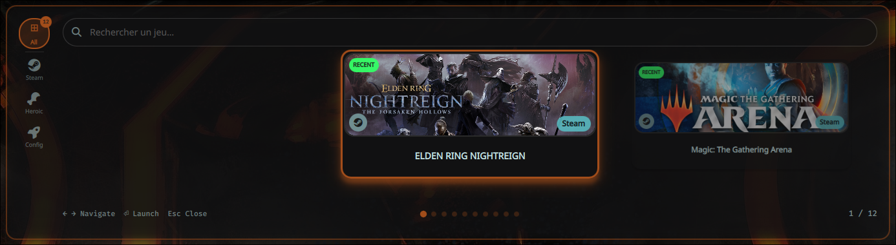

# Quickshell Game Launcher

Un launcher de jeux fait pour Hyprland, construit avec Quickshell (Qt6/QML) et un backend Python.
L'idée : avoir une interface rapide, jolie, qui se fond dans ton setup — covers automatiques, thème adaptatif via wallust, navigation clavier.

https://github.com/user-attachments/assets/703e48dd-86d1-49cb-8bc8-1fe45b89e9f5




---

## Ce que ça fait

- Détecte automatiquement tes jeux **Steam** en scannant les fichiers `.acf`
- Supporte **Heroic Games Launcher** (Epic, GOG, Amazon, sideload)
- Télécharge les covers depuis **SteamGridDB** (heroes animées, grids, logos)
- Thème adaptatif via **wallust** — les couleurs suivent ton wallpaper
- Navigation clavier complète (flèches, Enter, Escape, recherche live)
- Jeux manuels configurables en TOML
- Cache des images avec TTL configurable

---

## Installation

### Dépendances

```bash
# Quickshell
yay -S quickshell-git

# Python
sudo pacman -S python python-toml python-requests
```

### Mise en place

```bash
git clone ... ~/.config/quickshell/game-launcher
cd ~/.config/quickshell/game-launcher
```

Teste que le backend tourne :

```bash
python3 modules/service/backend.py
```

Tu devrais voir un JSON avec tes jeux.

### Keybind Hyprland

Dans `~/.config/hypr/hyprland.conf` :

```conf
bind = SUPER, G, exec, ~/.config/quickshell/game-launcher/toggle.sh
```

---

## Configuration

Tout se passe dans `config.toml` à la racine du projet.

### Affichage

```toml
[display]
position = "bottom"          # center, top, bottom
orientation = "horizontal"
grid_size = [3, 1]           # [colonnes, lignes]
item_width = 400
item_height = 200
spacing = 20
```

### Steam

```toml
[steam]
enabled = true
library_paths = [
    "~/.local/share/Steam/steamapps",
    "~/.var/app/com.valvesoftware.Steam/data/Steam/steamapps",  # Flatpak
    # "/mnt/games/SteamLibrary/steamapps",                      # disque externe
]
```

### Heroic (Epic / GOG / Amazon)

```toml
[heroic]
enabled = true
config_paths = ["~/.config/heroic"]
scan_epic = true
scan_gog = true
scan_amazon = true
scan_sideload = true
```

### Apparence & wallust

```toml
[appearance]
use_wallust = true
wallust_path = "~/.cache/wal/wal.json"
show_game_names = true
blur_background = true
background_opacity = 0.85
```

### Filtrage

Tu peux exclure des catégories ou des mots-clés pour virer les outils Steam qui polluent ta liste :

```toml
[filtering]
exclude_categories = ["desktop"]
exclude_keywords = ["Launcher", "Manager", "Runtime", "SDK", "Tool"]
```

---

## SteamGridDB

SteamGridDB est une base de données communautaire d'assets visuels pour les jeux — heroes, grids, logos, icônes. C'est bien plus riche que le CDN Steam de base, surtout pour les jeux non-Steam ou les covers animées.

### Obtenir une clé API

1. Crée un compte sur [steamgriddb.com](https://www.steamgriddb.com)
2. Va dans **Preferences → API** (ou directement `/profile/preferences/api`)
3. Génère une clé et colle-la dans `config.toml`

### Configuration

```toml
[steamgriddb]
enabled = true
api_key = "ta_clé_ici"

# Type d'image principal
# "hero"  → grande bannière horizontale (1920×620)
# "grid"  → cover verticale style Steam (600×900)
# "logo"  → logo PNG transparent
image_type = "hero"

# Préférer les versions animées (WebP/APNG) quand disponibles
prefer_animated = true

# Trier par nombre de likes — prend l'image la plus populaire en premier
sort_by_likes = true

# Filtre minimum de likes (0 = accepte tout)
min_likes = 0

# Perf : requêtes en parallèle
parallel_requests = true
max_workers = 12
request_timeout = 3      # secondes avant abandon

# Cache local : évite de retélécharger à chaque lancement
cache_ttl_hours = 48
```

### Comment ça marche

Le backend fait une recherche par nom de jeu sur l'API SteamGridDB, récupère la liste des images disponibles, les trie par likes, et télécharge la meilleure. Les images sont cachées localement dans `~/.cache/quickshell/game-launcher/`.

Si aucune image n'est trouvée sur SteamGridDB, le launcher bascule automatiquement sur le CDN Steam (`library_600x900.jpg`), puis sur un placeholder avec les initiales du jeu.

### Types d'images comparés

| Type | Dimensions | Usage |
|------|------------|-------|
| `hero` | 1920×620 | Bannière large, beau en layout horizontal |
| `grid` | 600×900 | Cover verticale, idéal en grille |
| `logo` | variable (PNG transparent) | Pour superposer sur un fond custom |

---

## Jeux manuels

Pour ajouter un jeu (ou une app) qui n'est pas dans Steam/Heroic :

```toml
[[entries]]
title = "Heroic Games"
launch_command = "heroic"
path_box_art = "heroic.png"  # relatif à box_art_dir

[[entries]]
title = "📚 Game Library"
launch_command = "kitty -e python3 ~/.config/quickshell/game-launcher/modules/service/list_games.py"
path_box_art = "library.png"
```

Les covers manuelles vont dans le dossier défini par `box_art_dir` (par défaut `~/.config/quickshell/game-launcher/box-art`).

---

## Raccourcis clavier

| Touche | Action |
|--------|--------|
| `SUPER + G` | Ouvrir / Fermer le launcher |
| `↑ ↓ ← →` | Naviguer dans la grille |
| `Enter` | Lancer le jeu sélectionné |
| `Escape` | Fermer |
| `/ ` ou `F` | Aller dans la barre de recherche |
| Double-clic | Lancer un jeu |

---

## Structure du projet

```
game-launcher/
├── shell.qml                      # Point d'entrée Quickshell
├── config.toml                    # Config principale
├── requirements.txt
├── toggle.sh                      # Toggle show/hide
├── modules/
│   ├── GameLauncher.qml           # Composant principal + grille
│   ├── GameCard.qml               # Carte individuelle
│   ├── LaunchOverlay.qml          # Overlay de lancement
│   └── service/
│       ├── backend.py             # Scan Steam/Heroic, SteamGridDB, TOML
│       ├── gamepad.py             # Support manette
│       ├── list_games.py          # Affichage bibliothèque
│       └── py_vdf_list.py
├── box-art/                       # Covers manuelles
├── cache/                         # Cache images SteamGridDB
└── Readme/
    ├── README.md
    ├── README_en.md
    └── asset/
        ├── Quickshell-game.mp4
        ├── image.png
        └── image_2.png
```

---

## Dépannage

**Le launcher ne s'ouvre pas**
```bash
quickshell -c ~/.config/quickshell/game-launcher/shell.qml
# Regarde les erreurs dans le terminal
```

**Pas de jeux Steam**
```bash
ls ~/.local/share/Steam/steamapps/*.acf
# Vérifie que le chemin dans config.toml correspond
```

**Les covers SteamGridDB ne chargent pas**
- Vérifie que ta clé API est correcte
- Regarde `cache/image_cache.json` pour voir les URLs résolues
- Mets `request_timeout` à une valeur plus haute si ta connexion est lente

**Erreur `No module named 'toml'`**
```bash
pip install toml
# ou
sudo pacman -S python-toml
```

---

## Crédits

Inspiré par [caelestia-dots/shell](https://github.com/caelestia-dots/shell)

Construit avec :
- [Quickshell](https://github.com/outfoxxed/quickshell) — Qt6/QML pour Wayland
- [SteamGridDB](https://www.steamgriddb.com) — API d'assets visuels
- [Wallust](https://codeberg.org/explosion-mental/wallust) — colorschemes depuis le wallpaper
- Python 3 + TOML
